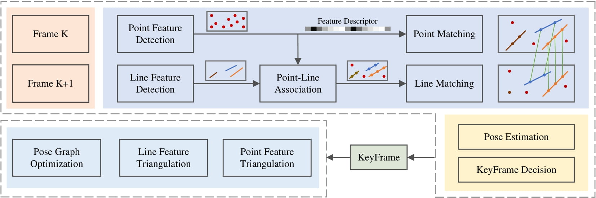
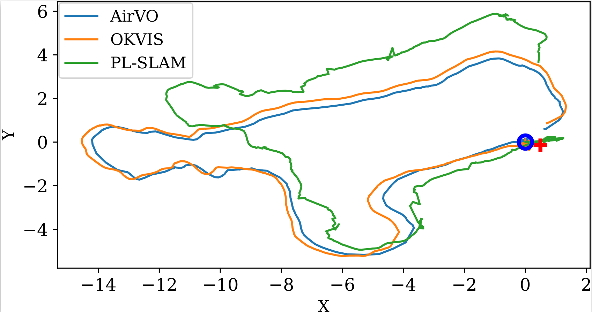

# AirVO
## An Illumination-Robust Point-Line Visual Odometry

 

AirVO is an **illumination-robust** and accurate **stereo visual odometry (VO) system** based on **point and line features**. It is a hybrid VO system that combines the efficiency of traditional optimization techniques with the robustness of learning-based methods. To be robust to illumination variation, we introduce both the **learning-based feature extraction ([SuperPoint](https://github.com/magicleap/SuperPointPretrainedNetwork))** and **matching ([SuperGlue](https://github.com/magicleap/SuperGluePretrainedNetwork)) method** to the system. Moreover, We propose a new line processing pipeline for VO that **associates 2D lines with learning-based 2D points** on the image, leading to more robust feature matching and triangulation. This novel method enhances the accuracy and reliability of VO, especially in illumination-challenging environments. By accelerating CNN and GNN parts using Nvidia TensorRT Toolkit, our point feature detection and matching achieve more than **5× faster** than the original codes. The system can run at a rate of about **15Hz** on the Nvidia Jetson AGX Xavier (a low-power embedded device) and **40Hz** on a notebook PC.

**Authors:** [Kuan Xu](https://github.com/xukuanHIT), [Yuefan Hao](https://github.com/yuefanhao), [Shenghai Yuan](https://scholar.google.com/citations?user=XcV_sesAAAAJ&hl=en), [Chen Wang](https://chenwang.site/), and [Lihua Xie](https://personal.ntu.edu.sg/elhxie/)


## Related Papers

**AirVO: An Illumination-Robust Point-Line Visual Odometry**, Kuan Xu, Yuefan Hao, Chen Wang and Lihua Xie, *arXiv preprint arXiv:2212.07595, 2022*. **[PDF](https://arxiv.org/abs/2212.07595)**.

If you use AirVO, please cite:

```bibtex
@article{xu2022airvo,
  title={AirVO: An Illumination-Robust Point-Line Visual Odometry},
  author={Xu, Kuan and Hao, Yuefan and Wang, Chen and Xie, Lihua},
  journal={arXiv preprint arXiv:2212.07595},
  year={2022}
}
```


## Demos

### UMA-VI dataset
[UMA-VI dataset](http://mapir.isa.uma.es/mapirwebsite/?p=2108) contains many sequences where images may suddenly darken as a result of turning off the lights. Here are demos on two sequences.



### OIVIO dataset
[OIVIO dataset](https://arpg.github.io/oivio/) collects data in mines and tunnels with onboard illumination.

 


### Live demo with realsense camera
We also test AirVO on sequences collected by Realsense D435I in the environment with continuous changing illumination. 


### More
[Video demo](https://www.youtube.com/watch?v=ZBggy5syysY)


## Efficiency Comparison
The evaluation is performed on the Nvidia Jetson AGX Xavier (2018), which is a low-power embedded platform with an 8-core ARM v8.2 64-bit CPU and a lowpower 512-core NVIDIA Volta GPU. The resolution of the input image sequence is 640 × 480. We extract 200 points and disabled the loop closure, relocalization and visualization part for all algorithms.


## Test Environment
### Dependencies
* OpenCV 4.2
* Eigen 3
* G2O
* TensorRT 8.4
* CUDA 11.6
* python
* onnx
* ROS noetic
* Boost
* Glog


### Docker (Recommend)
```bash
docker pull xukuanhit/air_slam:v1
docker run -it --env DISPLAY=$DISPLAY --volume /tmp/.X11-unix:/tmp/.X11-unix --privileged --runtime nvidia --gpus all --volume ${PWD}:/workspace --workdir /workspace --name air_slam xukuanhit/air_slam:v1 /bin/bash
```

## Data
The data should be organized using the Automous Systems Lab (ASL) dataset format just like the following:

```
dataroot
├── cam0
│   └── data
│       ├── 00001.jpg
│       ├── 00002.jpg
│       ├── 00003.jpg
│       └── ......
└── cam1
    └── data
        ├── 00001.jpg
        ├── 00002.jpg
        ├── 00003.jpg
        └── ......
```

## Build
```
    cd ~/catkin_ws/src
    git clone https://github.com/xukuanHIT/AirVO.git
    cd ../
    catkin_make
    source ~/catkin_ws/devel/setup.bash
```

## Run 

### [OIVIO Dataset](https://arpg.github.io/oivio/)
```
roslaunch air_vo oivio.launch 
```

### [UMA-VI Dataset](http://mapir.isa.uma.es/mapirwebsite/?p=2108)
```
roslaunch air_vo uma_bumblebee_indoor.launch 
```

### [Euroc Dataset](https://projects.asl.ethz.ch/datasets/doku.php?id=kmavvisualinertialdatasets)
```
roslaunch air_vo euroc.launch 
```

## Acknowledgements
We would like to thank [SuperPoint](https://github.com/magicleap/SuperPointPretrainedNetwork) and [SuperGlue](https://github.com/magicleap/SuperGluePretrainedNetwork) for making their project public.