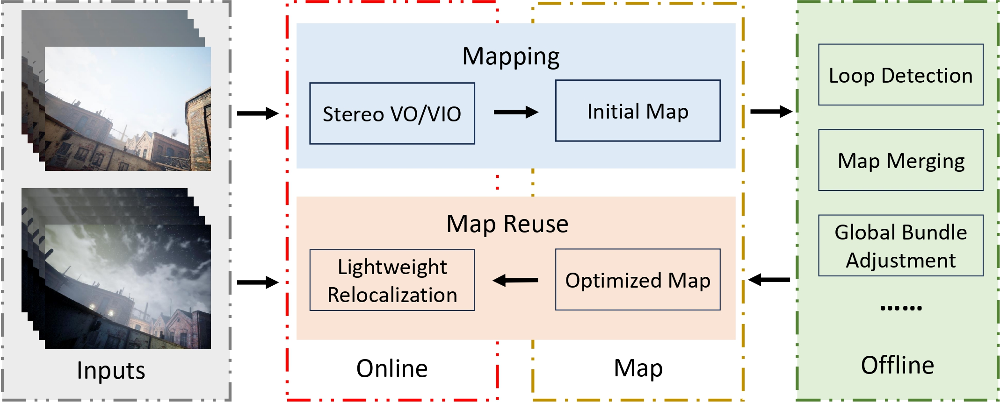
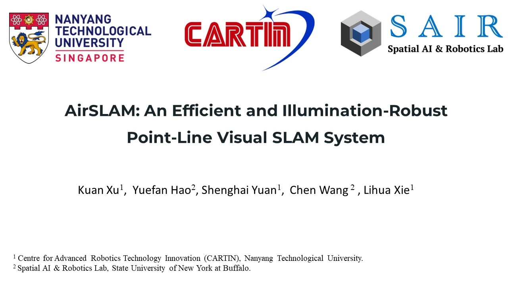

<h1 align="center">AirSLAM: An Efficient and Illumination-Robust Point-Line Visual SLAM System</h1>

<p align="center"><strong>
    <a href = "https://scholar.google.com/citations?user=-p7HvCMAAAAJ&hl=zh-CN">Kuan Xu</a><sup>1</sup>,
    <a href = "https://github.com/yuefanhao">Yuefan Hao</a><sup>2</sup>,
    <a href = "https://scholar.google.com/citations?user=XcV_sesAAAAJ&hl=en">Shenghai Yuan</a><sup>1</sup>,
    <a href = "https://sairlab.org/team/chenw/">Chen Wang</a><sup>2</sup>,
    <a href = "https://scholar.google.com.sg/citations?user=Fmrv3J8AAAAJ&hl=en">Lihua Xie</a><sup>1</sup>
</strong></p>

<p align="center"><strong>
    <a href = "https://www.ntu.edu.sg/cartin">1: Centre for Advanced Robotics Technology Innovation (CARTIN), Nanyang Technological University</a><br>
    <a href = "https://sairlab.org/">2: Spatial AI & Robotics (SAIR) Lab, Computer Science and Engineering, University at Buffalo</a><br>
</strong></p>

<p align="center"><strong> 
    <a href = "https://arxiv.org/pdf/2408.03520">&#128196; [Arxiv]</a> | 
    <a href = "https://xukuanhit.github.io/airslam/">&#128190; [Project Site]</a> |
    <a href = "https://youtu.be/5OcR5KeO5nc">&#127909; [Youtube]</a> |
    <a href = "https://www.bilibili.com/video/BV1rJY7efE9x">&#127909; [Bilibili]</a>
    <!-- &#128214; [OpenAccess] -->
</strong></p>

### :scroll: AirSLAM has dual modes (V-SLAM & VI-SLAM), upgraded from [AirVO (IROS23)](https://github.com/sair-lab/AirSLAM/releases/tag/1.0)

<p align="middle">
  
</p>

**AirSLAM** is an efficient visual SLAM system designed to tackle both short-term and long-term illumination
challenges. Our system adopts a hybrid approach that combines deep learning techniques for feature detection and matching with traditional backend optimization methods. Specifically, we propose a unified convolutional neural network (CNN) that simultaneously extracts keypoints and structural lines. These features are then associated, matched, triangulated, and optimized in a coupled manner. Additionally, we introduce a lightweight relocalization pipeline that reuses the built map, where keypoints, lines, and a structure graph are used to match the query frame with the map. To enhance the applicability of the proposed system to real-world robots, we deploy and accelerate the feature detection and matching networks using C++ and NVIDIA TensorRT. Extensive experiments conducted on various datasets demonstrate that our system outperforms other state-of-the-art visual SLAM systems in illumination-challenging environments. Efficiency evaluations show that our system can run at a rate of 73Hz on a PC and 40Hz on an embedded platform.

**Video**
<p align="middle">
<a href="https://youtu.be/5OcR5KeO5nc" target="_blank"></a>
</p>


## :eyes: Updates
* [2024.08] We release the code and paper for AirSLAM.
* [2023.07] AriVO is accepted by IROS 2023.
* [2022.10] We release the code and paper for AirVO. The code for AirVO can now be found [here](https://github.com/sair-lab/AirSLAM/tree/airvo_iros).


## :checkered_flag: Test Environment
### Dependencies
* OpenCV 4.2
* Eigen 3
* Ceres 2.0.0
* G2O (tag:20230223_git)
* TensorRT 8.6.1.6
* CUDA 12.1
* python
* ROS noetic
* Boost

### Docker (Recommend)
```bash
docker pull xukuanhit/air_slam:v4
docker run -it --env DISPLAY=$DISPLAY --volume /tmp/.X11-unix:/tmp/.X11-unix --privileged --runtime nvidia --gpus all --volume ${PWD}:/workspace --workdir /workspace --name air_slam xukuanhit/air_slam:v4 /bin/bash
```

## :book: Data
The data for mapping should be organized in the following Autonomous Systems Lab (ASL) dataset format (imu data is optional):

```
dataroot
├── cam0
│   └── data
│       ├── t0.jpg
│       ├── t1.jpg
│       ├── t2.jpg
│       └── ......
├── cam1
│   └── data
│       ├── t0.jpg
│       ├── t1.jpg
│       ├── t2.jpg
│       └── ......
└── imu0
    └── data.csv

```
After the map is built, the relocalization requires only monocular images. Therefore, you only need to place the query images in a folder.


## :computer: Build
```
    cd ~/catkin_ws/src
    git clone https://github.com/sair-lab/AirSLAM.git
    cd ../
    catkin_make
    source ~/catkin_ws/devel/setup.bash
```

## :running: Run 

The launch files for VO/VIO, map optimization, and relocalization are placed in [VO folder](launch/visual_odometry), [MR folder](launch/map_refinement), and [Reloc folder](launch/relocalization), respectively. Before running them, you need to modify the corresponding configurations according to your data path and the desired map-saving path. The following is an example of mapping, optimization, and relocalization with the EuRoC dataset.  


### Mapping
**1**: Change "dataroot" in [VO launch file](launch/visual_odometry/vo_euroc.launch) to your own data path. For the EuRoC dataset, "mav0" needs to be included in the path.

**2**: Change "saving_dir" in the same file to the path where you want to save the map and trajectory. **It must be an existing folder.**

**3**: Run the launch file:

```
roslaunch air_slam vo_euroc.launch 
```

### Map Optimization
**1**: Change "map_root" in [MR launch file](launch/map_refinement/mr_euroc.launch) to your own map path.

**2**: Run the launch file:

```
roslaunch air_slam mr_euroc.launch 
```

### Relocalization
**1**: Change "dataroot" in [Reloc launch file](launch/relocalization/reloc_euroc.launch) to your own query data path.

**2**: Change "map_root" in the same file to your own map path.

**3**: Run the launch file:

```
roslaunch air_slam reloc_euroc.launch 
```

### Other datasets
[Launch folder](launch) and [config folder](configs) respectively provide the launch files and configuration files for other datasets in the paper. If you want to run AirSLAM with your own dataset, you need to create your own camera file, configuration file, and launch file. 


## :writing_hand: TODO List

- [x] Initial release. :rocket:
- [ ] Support more GPUs and development environments
- [ ] Support SuperGlue as the feature matcher
- [ ] Optimize the TensorRT acceleration of PLNet


## :pencil: Citation
```bibtex
@article{xu2024airslam,
  title = {{AirSLAM}: An Efficient and Illumination-Robust Point-Line Visual SLAM System},
  author = {Xu, Kuan and Hao, Yuefan and Yuan, Shenghai and Wang, Chen and Xie, Lihua},
  journal = {arXiv preprint arXiv:2408.03520},
  year = {2024},
  url = {https://arxiv.org/abs/2408.03520},
  code = {https://github.com/sair-lab/AirSLAM},
}

@inproceedings{xu2023airvo,
  title = {{AirVO}: An Illumination-Robust Point-Line Visual Odometry},
  author = {Xu, Kuan and Hao, Yuefan and Yuan, Shenghai and Wang, Chen and Xie, Lihua},
  booktitle = {IEEE/RSJ International Conference on Intelligent Robots and Systems (IROS)},
  year = {2023},
  url = {https://arxiv.org/abs/2212.07595},
  code = {https://github.com/sair-lab/AirVO},
  video = {https://youtu.be/YfOCLll_PfU},
}
```
